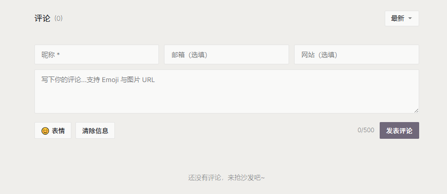
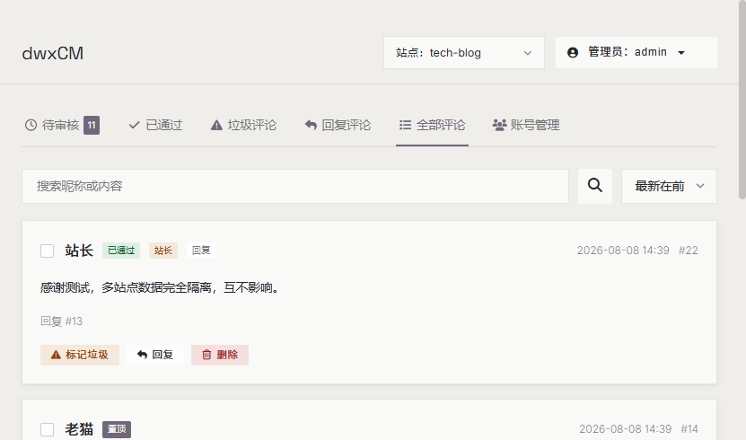
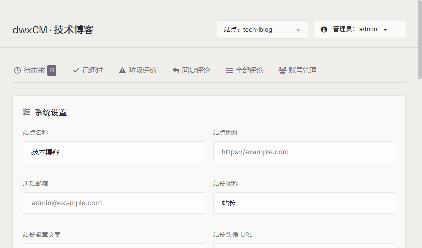
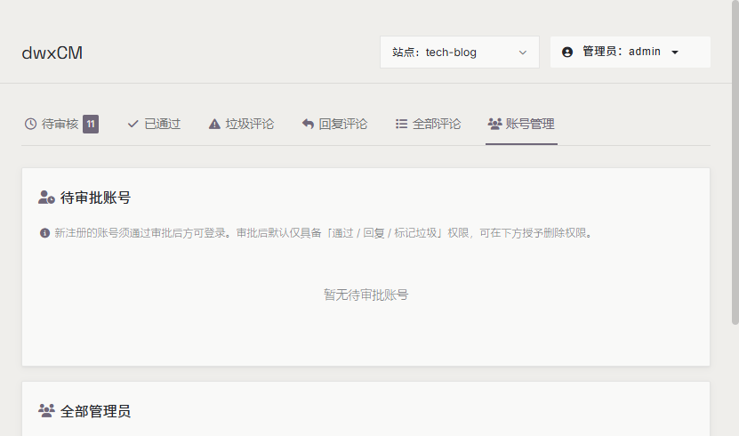

# dwxComment

> 极致轻量的自托管评论系统：**单二进制 + 单文件数据库 + 纯静态前端**。

dwxComment 是面向静态博客的自托管评论系统。后端由 Go 标准库编译成单个二进制，数据落在单个 SQLite 文件中，前端是零依赖的原生 HTML/CSS/JS。没有 Node 常驻进程、没有 Redis、没有 MySQL，一台 1 核 512MB 的小机器就能跑。

## 特性

- **零门槛评论**：评论者填个昵称就能发言，不注册、不登录
- **全量人工审核**：所有评论提交后先入后台，管理员过审才对外可见；敏感词命中只标记为"垃圾"，照常入库由人工判断，不做机器自动删除
- **极致轻量**：单二进制约 21.5MB，实测单实例 WorkingSet 峰值 29.2MB，1 核 512MB 机器可跑；读路径本地压测约 4.4 万 req/s，命中缓存延迟 <5ms
- **单文件数据库**：SQLite + 纯 Go 驱动（modernc.org/sqlite），无 CGO，交叉编译无痛
- **自研 LRU 缓存**：512 条 + 60 秒过期；审核通过 / 删除 / 置顶时主动清除该文章全部分页缓存
- **三层限流**：Nginx 全局限流 + Go 滑动窗口（单 IP 每秒 ≤5 次）+ 内容级计数器（单 IP 每日 ≤20 条），外加同页重复内容拦截
- **头像隐私保护**：前端永不接触邮箱字段；QQ 邮箱头像走服务端代理缓存，失败自动回退 Cravatar / 字母头像
- **数据迁移**：Waline JSON 完整适配（字段、审核状态、置顶、父子层级全保留），Twikoo / Disqus 支持基础字段导入；单次事务、失败全回滚，支持一键备份与分批导入
- **安全**：全参数化 SQL；JWT 放在请求头（免疫 CSRF）；错误信息不暴露内部细节；首个注册者自动成为站长，后续注册需站长审批
- **邮件通知**：新评论 / 管理员回复异步邮件通知

## 界面预览

<div align="center">
  
  
  <br/>
  
  
</div>

## 技术栈

| 层级 | 选择 | 理由 |
|------|------|------|
| 后端 | Go，标准库为主 | 编译为单二进制，零运行时 |
| 数据库 | SQLite（modernc.org/sqlite） | 单文件嵌入式，无 CGO 依赖 |
| 前端 | 原生 HTML/CSS/JS | ≤25KB，不引框架、无构建链 |
| 缓存 | 自研 LRU（map + 读写锁） | 读多写少场景够用，不引 Redis |
| 异步 | 协程 + channel | 队列容量 100，不引 MQ |

## 快速开始

### 1. 编译

```bash
# Windows（build.ps1 每次打包自动递增 VERSION）
.\build.ps1

# Linux / 交叉编译
.\build.ps1 -OS linux -Arch amd64

# 或直接 go build（无 CGO）
go build -trimpath -ldflags="-s -w" -o dwx-comment main.go
```

### 2. 配置

仓库不携带生产配置，请参照 [`config/config-bench.yaml`](config/config-bench.yaml) 创建 `config/config.yaml`。**必须修改的项：**

```yaml
server:
  port: 8080
  mode: release        # debug 允许默认密钥启动；release 下未改密钥将拒绝启动

auth:
  jwt_secret: "openssl rand -hex 16 生成的随机串"   # 默认密钥在生产环境会强制退出
  jwt_ttl: 86400

database:
  path: ./comment.db

cors:
  allowed_origins: ["https://你的博客域名.com"]   # 评论组件嵌入的页面域名

trusted_proxy:
  proxies: ["127.0.0.1/32"]   # 若前置 Nginx/CDN，需追加其出口 IP/CIDR，否则所有用户共享限流配额
```

### 3. 运行

```bash
./dwx-comment -config config/config.yaml
curl http://localhost:8080/api/v1/health   # 健康检查，返回版本号
```

### 4. 接入前端

将 [`front/comment.css`](front/comment.css)、[`front/comment.js`](front/comment.js) 引入博客页面，参照 [`front/comment.html`](front/comment.html) 中的用法。页面 ID（`page_id`）是评论归属页面的唯一标识：组件默认取当前页面的路径名（如 `/post/hello.html`），也可在容器元素上通过 `data-page-id` 属性显式覆盖。

### 5. 管理后台

访问 `/admin/`（本地直连部署由服务托管，生产建议由 Nginx 托管并限制访问）。**首个注册的账号自动成为站长**，后续注册的账号需站长在后台审批通过后才能登录。

## 项目结构

```
dwxcmt/
├── main.go              # 入口：装配配置/数据库/缓存/中间件，优雅退出
├── config/              # 配置加载与校验
├── router/              # 路由注册（公开接口 + 管理接口 + 静态资源）
├── controller/          # HTTP 控制器（评论/审核/迁移/账号/OAuth...）
├── service/             # 业务逻辑（审核/反垃圾/头像/置顶/迁移...）
├── middleware/          # 鉴权/CORS/限流/日志/Recovery
├── model/               # SQLite 数据访问层
├── migration/           # 数据库版本化迁移 SQL
├── pkg/                 # 可复用组件（LRU 缓存 / SMTP / 敏感词 / JWT 工具）
├── front/               # 静态前端（评论组件 + 管理后台）
├── docs/                # 项目文档（见下）
├── scripts/             # 压测 / 打包 / 运维脚本
├── build.ps1            # 一键打包（自动递增版本号）
└── docs-site/           # 文档站点页面
```

## 文档

| 文档 | 说明 |
|------|------|
| [01-需求规格说明书](docs/01-需求规格说明书.md) | 产品需求与功能规格 |
| [02-系统架构设计](docs/02-系统架构设计.md) | 架构与请求路径 |
| [03-数据库设计文档](docs/03-数据库设计文档.md) | 表结构与索引设计 |
| [04-API接口文档](docs/04-API接口文档.md) | 全部接口定义 |
| [05-前端实现方案](docs/05-前端实现方案.md) | 评论组件实现细节 |
| [06-部署运维手册](docs/06-部署运维手册.md) | Nginx 部署 / 更新 / 备份 |
| [07-性能测试报告](docs/07-性能测试报告.md) | 压测方法与结果 |
| [08-数据迁移指南](docs/08-数据迁移指南.md) | 从 Waline/Twikoo/Disqus 迁移 |

## 测试

```bash
go test ./...   # 单元 + 集成测试（含邮件流、迁移导入、头像、置顶、审核等）
```

性能压测脚本见 `scripts/`（`stress.ps1` / `stress.sh` / `bench-all.ps1`）。

## 许可证

[MIT](LICENSE)
